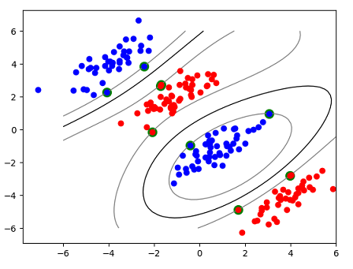
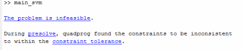
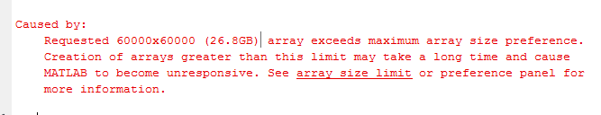
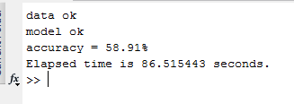
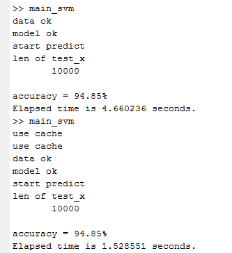

# Project3 - Digits Recognition 

## Naive Bayes

| Method      | Accuracy (Test) |
| ----------- | --------------- |
| bernoulli   | 41.82%          |
| multinomial | 81.82%          |

- normal方法：
  - 直接用特征$x_k=1|y=C_k$出现的频率作为$P(x_k=1|y=C_k)$
  - 即$$ {\displaystyle p(\mathbf {x} \mid C_{k})=\prod _{i=1}^{n}p_{ki}^{x_{i}}(1-p_{ki})^{(1-x_{i})}}$$
  - 在learning 的阶段统计似然，在inference的阶段计算后验概率。
- multinomial方法:
  - 参考https://en.wikipedia.org/wiki/Naive_Bayes_classifier#Multinomial_naive_Bayes
  - 不过有一点不同的是在inference的时候，会将观察到的test_x拟合到gamma分布上$${\displaystyle p(\mathbf {x} \mid C_{k})=\frac{\Gamma(\sum_i x_i + 1)}{\prod_i \Gamma(x_i+1)}\prod _{i}{p_{ki}}^{x_{i}}}$$

## SVM

最终Accuracy：94.85%！测试方法：在当前路径下有`final.mat`的情况下，运行`main_svm.m`，只需耗时1.5s（路径下有数据cache）或4s。

- `my_mini_svm`是我用quadprog实现的简单版的svm，加入了soft margin 和kernel trick。

- 如果不加入soft margin的话，对于Mnist识别这样的non-linear separated 的问题，可行解都会没有。 

  

- 但是由于样本数量比较大，一次性分配H矩阵需要很多内存。把样本数量减小到600只剩下40.5%的准确率。

  

- 于是使用的是matlab的`fitcsvm`采用SMO算法，能够序贯地学习权重。在训练了比较久的时间之后，只进行测试耗时为86.5秒，测试准确率仍然为58.91%。测试时间长应该是因为我一开始用了全部数据训练，模型记忆的支持向量比较多。准确率低，最终发现是因为存在bug。

  

- 于是仔细检查了程序，发现是`train_t = train_y==ind;` 不合理，要么改为`train_t = 2*((train_y==ind-1) -0.5 );`，要么不要用matlab默认的`'ClassNames'为[-1 1]`。简单的说，就是最终预测label和ground truth label的取值范围要么都用[-1,1]，要么都用[0,1]。

  - 训练的时候因为想让训练时间短一点，训练数据只选用了785个。（说明模型的泛化能力好，并且还有提升的空间。）
  - 实验中，我发现使用HOG特征准确率是最高的。
  - 同时我加入了fminsearch启发式搜索最优参数组合的过程。
  - 最终准确率为94.85%！所有参数都保存在`final.mat`中，如果将数据cache的train_mnist.mat和test_mnist.mat删除，多test几次准确率都是相同的，均为94.85%。（下图中第一次是没有cache的预测结果，第二次是有cache之后的预测结果）

  

  - 测试时间稳定在1.5s左右（不考虑提取feature的时间），说明discriminative method虽然学习参数的过程很慢，但是一旦学到了参数能够高效地预测。比如SVM预测时只需要和支持向量比较，不需要和所有样本比较！

