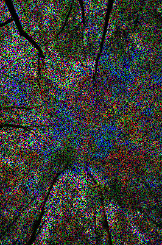

# Artificial Intelligence 

## Demo 

|Corrupted img|Restored img|
|---|---|
|| |
|| |

## TODO 
- [X] LR model
    - [X] SVD 
        
- [x] CNN model 
    - [X] Data preprocessing 
    - [X] Load Image from Disk 
    - [x] Test multiprocess and GIL 
    - [x] Log to logger 
    - [x] Flexible Input Dim 
    - [x] Model Selection 
    - [x] Pretrain by voc
    - [x] post precess
    - [x] gray img problem
        - [x] problem Because size or dark or jpg 
        - [x] medianfilters test 
        - [x] png v.s. jpg    
    - [x] Grid Search Hyper-parameter 
        - [x] Trainable = False
    
    