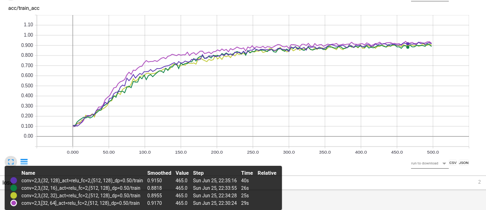
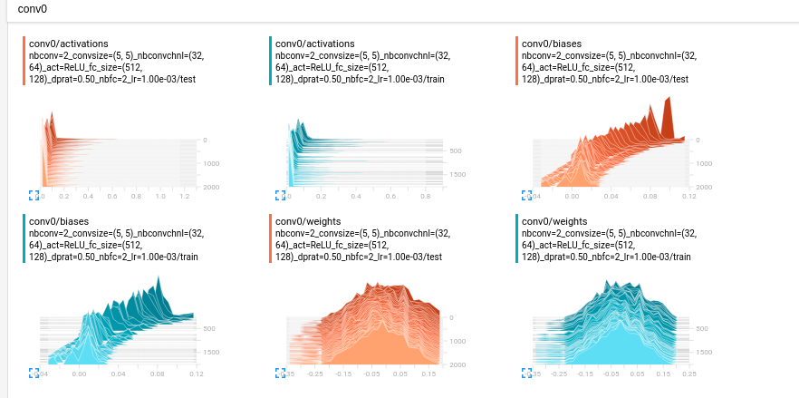

# Artificial Intelligence Project3

[TOC]

## Results

最终超参数搜索的结果如下，之后在Section2 Experiment逐个分析

## Experiments
### Numbers of Conv & Pooling Layers
| Number of layers                     |
| ------------------------------------ |
| Train Acc                            |
|  |
| Test Acc                             |
|    |

- Baseline采用`[Conv-ReLU-Pool]*2-[fc-ReLU]*3`的结构，Kernel_size/Field of Conv=3, Dropout Ratio=0.5,，两层Conv通道数为[32,64]，3层fc Size为[512,128,10]。由于默认Dropout为0.5，训练时引入了随机性，所以训练上波动比较厉害。
- 由于Mnist分类任务比较简单，Accuracy都可以达到95%以上，但是如果放大Y轴，2/3层Conv的Accuracy会更高。
- 1层Conv收敛速度更快

### Kernel Size 

- 原始的LeNet网络采用的是5X5的感受野，后来VGG的提出更小的感受野--3X3效果更好。从收敛性和最终准确率的角度，Mnist上的结果都验证了这一点。同时也发现1X1的感受野会使得效果下降很多。

### Numbers of Conv Channels

- Conv Channel数目一般是逐步增加，因此不合理的[32,32],[32,16]参数，Accuracy会比较低。同时进一步增加Channel数目，可能由于数据集比较简单，没有明显的提升

### Activation Functions

- 从Accuracy看，tanh/relu优于sigmoid，从收敛性看，relu收敛最快。

### FC Size

- 由于最后一层必须是10类，并且使用softmax的分类层，因此我是在倒数第二层上改的，随着fc size的增加，收敛速度变慢，准确率趋于饱和。

### Dropout Ratio

- 增加Dropout 能防止过拟合，训练集准确率低于测试集准确率。这是因为：得到Train Acc的过程也会有Dropout，得到Test Acc的时候才使用全部的参数。
- 但是丢弃的太多之后，也会导致训练不收敛
- 如果以dropout ratio=0.9进一步训练，可以预见Test Accuracy能达到99%以上。

### Number of FC Layers

- 网络变深，训练难度加大。由于可能只训练了500 epoches，因此3层全连接的网络在训练集上都无法达到90以上的准确率。

## Others

- Baseline结构如下​
  
- 从参数权重的可视化中可以看出，bias具有平移超平面的作用，因此通常不为0，所以课上也提到加Regulerize的时候，通常只加在weight上。
  

